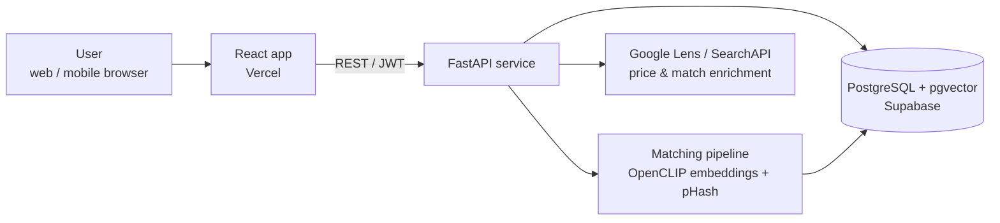

# Yanni — AI-Powered Pricing, Inventory & Knowledge Platform for Vintage Apparel

**Live product:** [yanni.app](https://yanni.app)
**Author:** Johann Piedras ([github.com/Llovos](https://github.com/Llovos))

> The application source code is private. This repository is a technical case study documenting the product, architecture, and engineering decisions behind it.

Yanni (evolved from an earlier project, *Vintage Shirt Tracker*) helps vintage clothing sellers and collectors answer three hard questions: **What is this item? What is it worth? What do I own?** It combines reverse image search, vector-embedding similarity matching, and marketplace price aggregation into a single pricing, inventory, and knowledge tool. It currently stores 600+ structured items and serves early users ahead of a public launch.

I designed, built, deployed, and operate the product end to end — product requirements, architecture, data model, integrations, testing, deployment, and iteration — using AI-assisted development workflows (Claude, ChatGPT, Cursor) with full ownership of every design decision.

---

## Screenshots

<!-- TODO: add screenshots to docs/screenshots/ and reference them here -->
<!-- Suggested shots: search results page, item detail w/ price data, inventory view, image-match results -->

*Screenshots coming soon.*

## Features

- **Reverse image search** — snap or upload a photo of a garment and find matching or similar known items
- **Visual similarity matching** — OpenCLIP embeddings + perceptual hashing (pHash) over a pgvector index
- **Market price aggregation** — enrichment via Google Lens / SearchAPI integrations to surface comparable listings and sold prices
- **Personal inventory tracker** — structured records for a seller's or collector's own items
- **Bulk import** — CSV and image batch imports for high-volume sellers
- **Passwordless authentication** — email-based login issuing JWTs; no passwords stored

## Technology Stack

| Layer | Technology |
|---|---|
| Frontend | React (deployed on Vercel) |
| API | Python, FastAPI (REST) |
| Database | PostgreSQL with pgvector (Supabase) |
| ML / matching | OpenCLIP image embeddings, pHash perceptual hashing |
| External data | Google Lens / SearchAPI integrations |
| Auth | Passwordless email flow, JWT sessions |
| Hosting | Vercel + Supabase (earlier versions self-hosted on a Linux VPS behind Nginx) |

## Architecture

### Image search & matching flow

1. User uploads an image (single item or bulk batch).
2. The pipeline computes a **pHash** (fast, near-duplicate detection) and an **OpenCLIP embedding** (semantic visual similarity).
3. pgvector performs nearest-neighbor search against the item catalog; pHash short-circuits exact/near-exact matches cheaply before falling back to embedding similarity.
4. For pricing, the item is enriched through Google Lens / SearchAPI to pull comparable market listings, which are aggregated into a price view alongside internal catalog knowledge.
5. Confirmed matches feed back into the catalog, so the knowledge base compounds as usage grows.

## Engineering Decisions & Tradeoffs

- **pHash + embeddings, not embeddings alone.** Perceptual hashing catches re-uploads and near-duplicates at a fraction of the cost of embedding search; CLIP embeddings handle the genuinely hard "same shirt, different photo" cases. Layering them keeps latency and compute down.
- **pgvector over a dedicated vector database.** At this catalog size, keeping vectors next to relational data in Postgres removes an entire service to operate and keeps matching queries joinable with item metadata. A dedicated vector store only wins at a scale the product hasn't reached yet.
- **Managed platform (Vercel + Supabase) over self-hosted VPS.** The first iterations ran on a Linux VPS behind Nginx, which I provisioned and operated myself. Migrating to managed hosting traded some control for far less operational overhead — the right call for a solo builder shipping product iterations.
- **Passwordless auth.** Removes password storage/reset burden entirely and matches how casual sellers actually behave; JWTs keep the API stateless.
- **Third-party search enrichment (SearchAPI) as a dependency.** Building price scraping in-house was possible but fragile and maintenance-heavy; an API dependency was the pragmatic choice, isolated behind an internal interface so it can be swapped.

## Roadmap

- Public launch and onboarding flow
- Expanded catalog coverage beyond t-shirts into more vintage categories
- Pricing history and trend views
- Seller-facing bulk listing exports (marketplace CSV formats)
- Public API for power users

---

*Questions or feedback: open an issue here or reach me through [yanni.app](https://yanni.app).*
