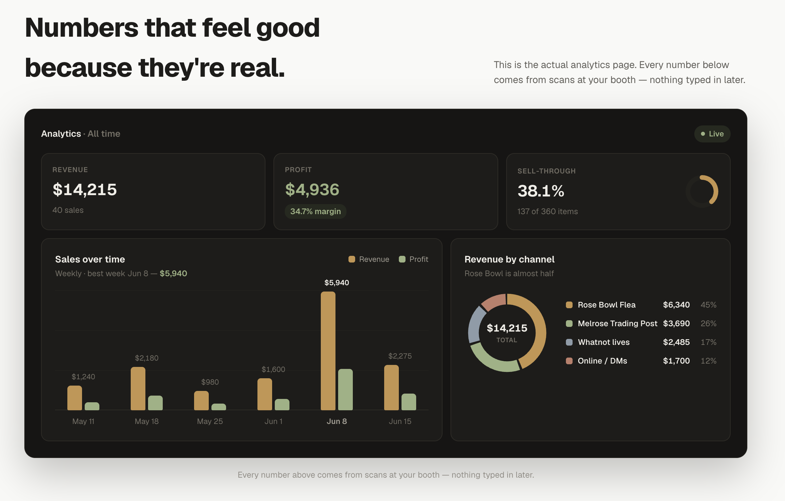
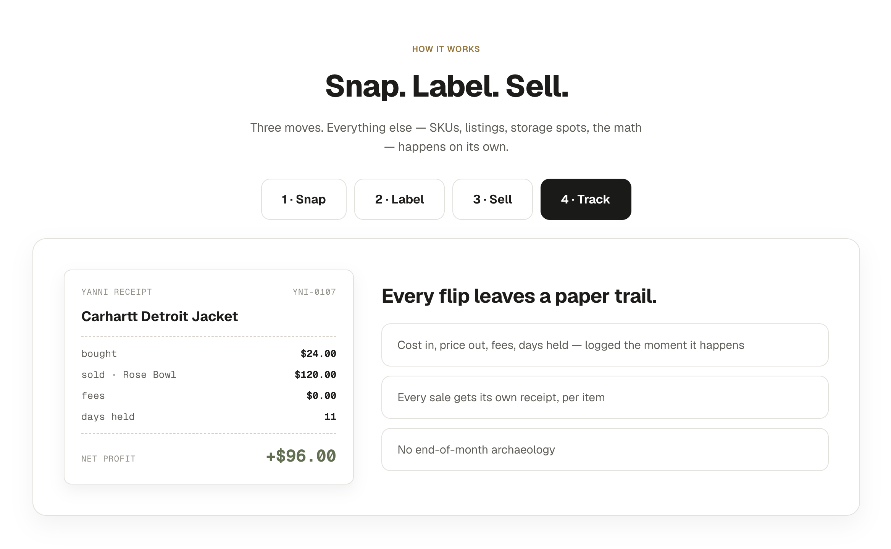
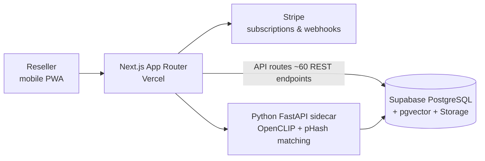

# Yanni — Photo-First Inventory & Point-of-Sale for Vintage Resellers

**Live product:** [yanni.app](https://yanni.app)
**Author:** Johann Piedras ([github.com/Llovos](https://github.com/Llovos))

> The application source code is private. This repository is a technical case study documenting the product, architecture, and engineering decisions behind it.

Yanni is an inventory management and point-of-sale tool built for vintage clothing resellers who sell both in person (pop-ups, flea markets, Whatnot live shows) and online. It replaces messy spreadsheets, phone photo folders, and mental math with a photo-first inventory system that tracks cost of goods, powers a QR-scan checkout flow for in-person sales, and generates printable labels for physical inventory.

I designed, built, and operate the product end to end — requirements, architecture, data model, integrations, testing, deployment, and iteration — with full ownership of every design decision. I also run a vintage business myself, so the product is built from direct operating experience.

---

## Screenshots

**Live analytics** — revenue, profit, and sell-through computed from booth scans, with weekly sales and per-channel revenue breakdowns:

**Per-item tracking** — every sale generates its own receipt with cost in, price out, fees, days held, and net profit logged at the moment of sale:

## Core Design Principles

1. **Camera is the primary input.** Only a photo is required to create an item — everything else auto-fills or is optional. Resellers won't do data entry on a warehouse floor.
2. **Know your numbers at the moment of sale.** COGS, break-even, and margin are visible at checkout, not in a month-end spreadsheet.
3. **Bundle math is first-class.** Resellers buy in bulk lots; per-item cost allocation from bundles is core, not an afterthought.
4. **Speed at the point of sale.** Three matching strategies at POS: QR scan (primary), photo match (fallback), manual SKU (last resort).
5. **Mobile-first PWA.** Used standing up at a flea market, not sitting at a desk.

## Features

- **Photo-first inventory** — 16-model relational schema covering items, bundles, storage locations, events, sales, and expenses
- **QR-code checkout POS** — scan a printed label, build a sale, park it, complete it; per-item margin shown live
- **Whatnot bulk-upload export** — turn an event's inventory into a Whatnot-ready CSV
- **Multi-user businesses** — role-based permissions, member invites, showroom access, audit logging
- **Money math built in** — per-item COGS from bundle allocation, P&L analytics, expense tracking, tax-report CSV exports
- **Printable labels** — batch label generation connecting physical inventory to digital records
- **Photo matching** — OpenCLIP embeddings + perceptual hashing (pHash) over pgvector for find-by-photo
- **Subscription billing** — Stripe-backed plan tiers with a single source of truth for plan limits shared by billing and marketing UI

## Technology Stack

| Layer | Technology |
|---|---|
| Framework | Next.js App Router (TypeScript), mobile-first PWA |
| Styling | Tailwind CSS v4 |
| Data | Supabase — PostgreSQL with pgvector, Auth, image Storage; Prisma ORM |
| Payments | Stripe (subscriptions; PaymentIntent flows) |
| ML sidecar | Python FastAPI service — OpenCLIP ViT-B-32 embeddings, pHash, vector similarity |
| QR | Server-generated QR labels; in-browser scanning |
| Quality | Vitest unit + integration tests; Sentry error monitoring; Vercel Analytics |
| Hosting | Vercel (app), Supabase (data) |

## Architecture

- One database: Prisma handles relational models; raw SQL for pgvector similarity queries.
- The ML sidecar is stateless — it loads the CLIP model, takes an image, returns a vector or match. If it's down, the app degrades gracefully: everything works except photo matching.
- Plan limits, tier names, and feature flags live in a single `plan.ts` module that both the billing logic and the public pricing page derive from, so marketing copy can't drift from enforcement.

## Engineering Decisions & Tradeoffs

- **Next.js monolith + Python sidecar, instead of the previous FastAPI + React split.** The predecessor product (below) ran a separate Python API and JS frontend. Collapsing CRUD, auth, and billing into Next.js API routes removed a deployment unit and a CORS/session boundary; Python remains only where it earns its place — the ML workload.
- **pHash + CLIP embeddings, layered.** Perceptual hashing catches exact/near-duplicate photos at negligible cost; CLIP handles "same shirt, different photo." pgvector keeps vectors joinable with item metadata instead of adding a dedicated vector store.
- **QR-first POS with photo-match fallback.** Scanning a physical label is faster and more reliable than visual matching at a chaotic market table; photo match exists for unlabeled items rather than as the primary path.
- **One-of-a-kind inventory semantics.** No quantity field — vintage items are unique. Sale flows and race-condition handling are built around "this exact item," a lesson carried over from building my own store's checkout (double-sell protection with automatic refunds inside database transactions).
- **Tests where the money is.** Vitest coverage concentrates on pricing/COGS math, permissions, payment settings, and export formats — the logic where silent bugs cost users real dollars.

## Prior Art: Vintage Shirt Tracker (predecessor)

Yanni's matching pipeline was production-proven in **Vintage Shirt Tracker**, a "KBB for vintage clothes" I built and self-hosted earlier:

- Upload a shirt photo → matching cascade: pHash → CLIP cosine similarity → SearchAPI.io Google Lens
- Marketplace price aggregation (eBay, Etsy, Grailed…) with noise-domain filtering and price statistics (min / median / p25 / p75) from comparable listings, cached with a 14-day expiry
- Python FastAPI + async SQLAlchemy + PostgreSQL/pgvector; React 18 SPA; passwordless magic-link auth (JWT in httponly cookies)
- Community catalog with bulk CSV/image import and voting; 600+ structured items
- Deployed on an Ubuntu VPS I operated myself: Nginx reverse proxy, systemd service, one-command deploy script

## Roadmap

- Photo-match and auto-labeling rollout via the ML sidecar
- Reverse-image comps/pricing (porting the Vintage Shirt Tracker search pipeline)
- Online sales channels (Stripe checkout for buyers)
- Deeper marketplace integrations beyond Whatnot CSV export

---

*Questions or feedback: open an issue here or reach me through [yanni.app](https://yanni.app).*
